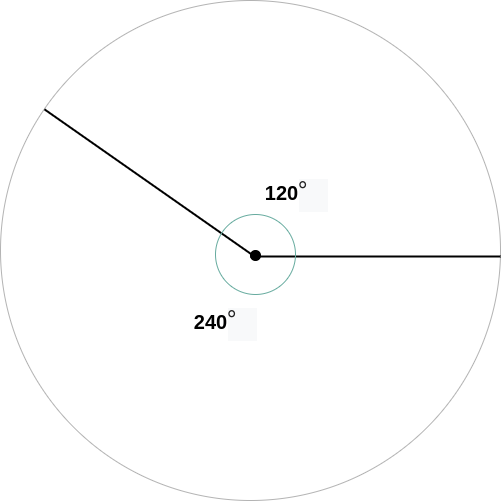

## Java: Разница углов

Напишите метод <convert style=color:red> diff() </convert>, который принимает два угла (integer), каждый от 0 до 360, и возвращает разницу между ними.

Угол между лучами измеряется двумя способами:



Функция должна вернуть наименьшее значение.


```markdown
diff(0, 45) === 45;   // не 315, а 45, потому что 45 меньше
diff(0, 180) === 180;
diff(0, 190) === 170; // не 190, а 170, потому что 170 меньше
diff(120, 280) === 160;
```

# Подсказки
 - В решении вам могут пригодиться методы класса [Math](https://docs.oracle.com/en/java/javase/17/docs/api/java.base/java/lang/Math.html)